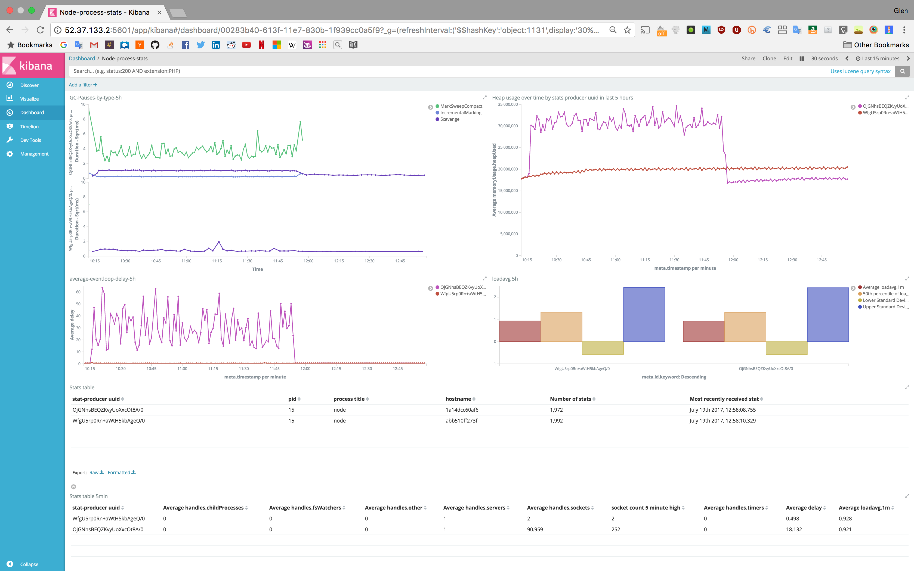

# stats-to-elasticsearch

[](https://travis-ci.org/nearform/stats-to-elasticsearch)

Collect and send [stats](http://github.com/nearform/stats) about your node.js process to elasticsearch.

This module exposes a function which initialises a connection to elasticsearch and creates a stats event emitter to gather useful in process stats to be sent via the connection.

## Intro to the nearform stats tooling

Created with the purpose to make creating visualisations about your process easy. At nearform, we achieve this using the modules [stats](http://github.com/nearform/stats), [stats-to-elasticsearch](http://github.com/nearform/stats-to-elasticsearch) and [create-stats-dashboard](http://github.com/nearform/create-stats-dashboard). This makes it very easy to collect process stats in elasticsearch and visualise them in a dashboard in kibana, similar to that below:



Once your dashboard is setup with create-stats-dashboard, all you should need to do is require the stats-to-elasticsearch module and point it at the dashboard to get cool (and useful) visualisations!

## Installation

```
npm i -s @nearform/stats-to-elasticsearch
```

## Usage

```js
const StatsToElastic = require('@nearform/stats-to-elasticsearch')
const statsToElastic = StatsToElastic({elaticsearchConfig: {...}, statsConfig: {...}})
```

Or you can preload your process with this module like so:

```
ES_HOST=localhost ES_PORT=9200 node -r @nearform/stats-to-elasticsearch index.js
```

## API

```
StatsToElastic(opts)
```

Returns: An object configured with an open connection to elasticsearch and a stats event emitter to gather stats from.

`Opts` is an object which can contain the following properties:
- `elasticsearchConfig`: a configuration object which is passed to the [elasticsearch module](http://npm.im/elasticsearch) when initialising the connection. Configured with the following defaults:
  - ```js
      {
        host: 'localhost:9200',
        log: 'error',
        maxRetries: Number.MAX_SAFE_INTEGER,
        sniffOnStart: true,
        keepAlive: true,
        sniffOnConnectionFault: true
      }
    ```
The `host` property can be modified using the ES\_HOST and ES\_PORT env variables. Useful if preloading your process.

- `statsConfig`: A configuration object which is passed to the [stats module](http://github.com/nearform/stats) when initialising the stats event emitter. Configured to use the standard stats defaults.

The object which was returned contains the following methods:

```
statsToElastic.start()
```

Starts the stats event emitter emitting stats to be sent to elasticsearch - NOTE: Called automatically on startup, only neccessary if you stop emitting events

```
statsToElastic.stop()
```

Stops the stats event emitter emitting stats

```
statsToElastic.close()
```

Closes the connection to elasticsearch and stop the event emitter emitting stats, so you can cleanly exit your process

```
statsToElastic.reconnect()
```

Reconnects to elasticsearch if no longer connected. NOTE: this doesn't call start, so call `start()` yourself if you need to.

## Useful links

- [stats](http://github.com/nearform/stats) - makes generating the stats to be visualised a breeze!
- [stats-to-elasticsearch](http://github.com/nearform/stats-to-elasticsearch) - makes sending the stats to es a breeze!
- [create-stats-dashboard](http://github.com/nearform/create-stats-dashboard) - makes creating your kibana dashboard a breeze!

## License

Apache 2.0